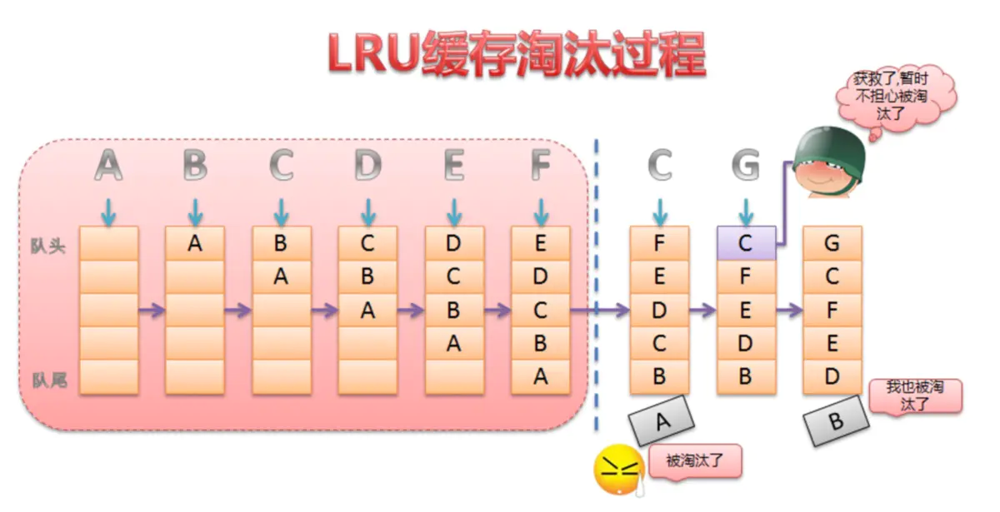

# javascript 源码分析  

## 数据结构介绍
Map + yallist = 哈希双向链表
- yallist npm包 双向链表
- Map 哈希表

### 缓存策略
一般来说，缓存策略主要包含缓存的添加、获取和删除这三类操作。如何添加和获取缓存这个比较好理解，那么为什么还要删除缓存呢？这是因为不管是内存缓存还是硬盘缓存，它们的缓存大小都是有限的。当缓存满了之后，再想其添加缓存，这个时候就需要删除一些旧的缓存并添加新的缓存。

因此LRU(Least Recently Used)缓存算法便应运而生，LRU是近期最少使用的算法，它的核心思想是当缓存满时，会优先淘汰那些近期最少使用的缓存对象。采用LRU算法的缓存有两种：LrhCache和DisLruCache，分别用于实现内存缓存和硬盘缓存，其核心思想都是LRU缓存算法。

### 实现原理
LruCache的核心思想很好理解，就是要维护一个缓存对象列表，其中对象列表的排列方式是按照访问顺序实现的，即一直没访问的对象，将放在队尾，即将被淘汰。而最近访问的对象将放在队头，最后被淘汰。



这个队列就是由哈希链表去维护，可以实现按访问顺序与插入顺序，使得<key, value> 


## Lru-cache 类

### construstor 
```js
class LRUCache {
  constructor (options) {
    if (typeof options === 'number')
      options = { max: options } 

    if (!options)
      options = {}

    if (options.max && (typeof options.max !== 'number' || options.max < 0))
      throw new TypeError('max must be a non-negative number')
    // Kind of weird to have a default max of Infinity, but oh well.
    const max = this[MAX] = options.max || Infinity

    const lc = options.length || naiveLength
    this[LENGTH_CALCULATOR] = (typeof lc !== 'function') ? naiveLength : lc
    this[ALLOW_STALE] = options.stale || false
    if (options.maxAge && typeof options.maxAge !== 'number')
      throw new TypeError('maxAge must be a number')
    this[MAX_AGE] = options.maxAge || 0
    this[DISPOSE] = options.dispose
    this[NO_DISPOSE_ON_SET] = options.noDisposeOnSet || false
    this[UPDATE_AGE_ON_GET] = options.updateAgeOnGet || false
    this.reset() // new Map 与 new yallist
  }
  ...
}  
```
1. 先对传入的```options```做类型判断，如果是```number类型，作为```max``` 最大容量处理
2. 对 ```length```长度计算器 ```lengthCalCulator```、过期控制值```stale```、最大过期时间```maxAge```、钩子函数```DISPOSE```、 ```noDisposeOnSet```、```updateAgeOnGet```进行默认赋值;
3. reset new 一个 Map 实例Cache去记录链表引用, new一个yallist双向链表lru-list维护保存数据:
```js
    this[CACHE] = new Map() // hash of items by key
    this[LRU_LIST] = new Yallist() // list of items in order of use recency
```
后面会讲两者如何配合使用

## 原型方法


### get
### set 
### trim 剪枝
