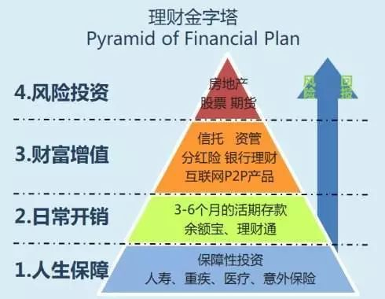

# 理财
[[toc]]

## 理财含义
投资 = 理财？不等于投资是理财的一个形式

## 为什么要理财
- 通货膨胀

## 理财观念
单利 
复利 = 现金 + 利息 = 利滚利
三要素 现金 + 利率 + 时间

## 资产是什么
|生钱资产   |耗钱资产  |其他资产  |
| ------- |:-------:| -------:|   
|能够生钱   |自用     | 无资金流入|

## 资产配置投资品种
现金类
保障
权益
另类


## 个人资金配置

|体系           |百分比  |月收入  |实际金额|
| ------- |:-------:| -------:|:-------:|   
|财务自由自由（生钱）| 40% | 10000 |  4000 |
|风险保障资金       | 10% | 10000 |  1000 |
|学习培训资金       | 20% | 10000 |  2000 |
|生活保障           |30% | 10000 |  3000 |

## 理财工具
### 理财金字塔


### 主流工具
- 存银行
- 股票
- 基金（比较推荐）：```路径：``` 支付宝 => 基金排行 => 类型 => 概括指标：
    - 不少于5年，
    - 资产5亿以上 
    - （A结尾 不收管理费，C结尾 以后可能会收管理费）
    - 任期：投资经理不要经常变来变去
    - 投入类型：
        - 定投（比较推荐）：定时一个月买一次；
            什么时候开始不重要，重要是开始
            收益多少不重要，重要的是止盈（落袋为安）；
        - 买入
    - 投资策略：年终止盈或者升幅（20%）止盈

- P2P 高风险，容易血本无归
- 募资 
- ...等等

## 一夜暴富
请看《刑法》